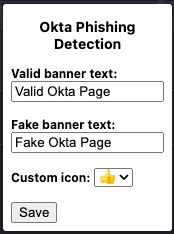
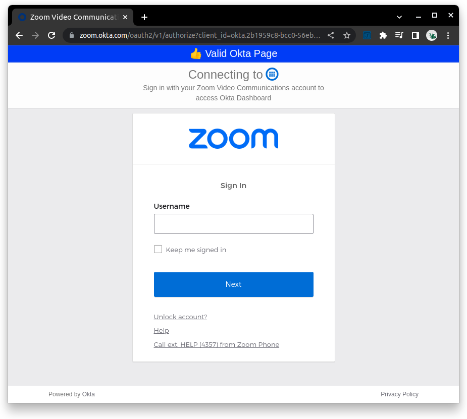
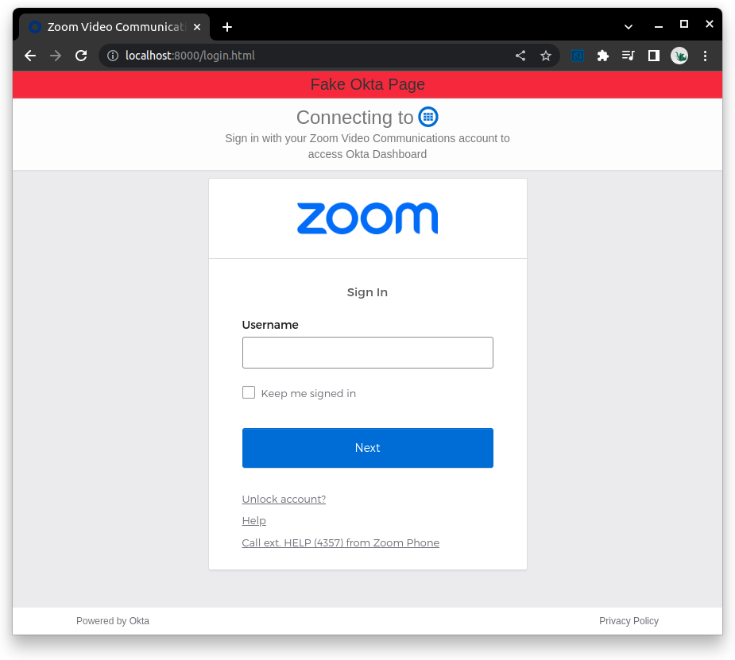

# Okta-Phishing-Detection

## Overview

This browser extension displays a banner on an Okta login page to help the user determine if it's a valid login page. This could help against attacks that proxy traffic to the legitimate Okta login page using a tool like [evilginx2](https://github.com/kgretzky/evilginx2).

## Sideload the Chrome Extension

1. Download / clone this repo
2. Open the extensions page (`chrome://extensions/`)
3. Toggle on the **Developer mode** setting
4. Click on **Load unpacked**
5. Select the `extension` directory from this repo

## Usage

Once the extension is loaded, it will display a banner on pages it identifies as Okta login pages. It does this in two ways:

1. Identifies valid login pages based on if the domain ends with `.okta.com` and has a copyright footer containing `Powered by Okta`.
2. Invalid or fake login pages are identified by domains not ending with `.okta.com` and still having the copyright footer.

**Note:** There may be some edge cases I have not identified and can update the logic above as needed. Feel free to submit a PR.

You can customize the banner by clicking on the extension icon and changing the text or icon and clicking "Save".

## Examples

Based on [Okta's customers](https://www.okta.com/customers/), we can see Zoom's Okta login page:

As an example, I cloned the page and hosted it locally to show that the browser extension correctly identifies the malicious page:

