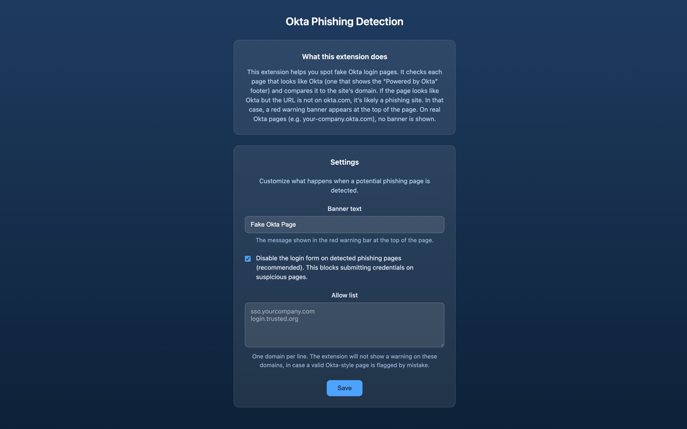
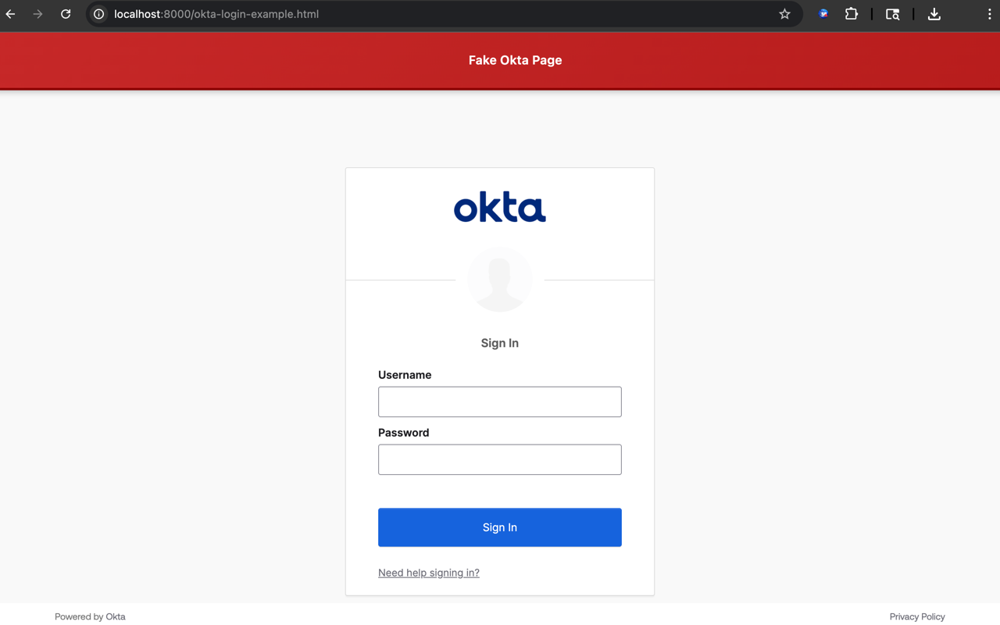

# Okta Phishing Detection

## Overview

This browser extension helps you tell real Okta logins from fake ones. It shows a **red warning banner only** when a page looks like Okta (e.g. has the “Powered by Okta” footer) but the site is **not** on `okta.com`—a strong sign of phishing or a proxied attack (e.g. via [evilginx2](https://github.com/kgretzky/evilginx2)). On real Okta pages (such as `your-company.okta.com`), no banner is shown.

## Install

Install from the Chrome Web Store:

[Okta Phishing Detection](https://chrome.google.com/webstore/detail/okta-phishing-detection/nfgacdcbhlnhengjkgmaicngehehndga)

## Sideload the extension

You can also load the extension unpacked for development or custom changes:

1. Download or clone this repo.
2. Open `chrome://extensions/`.
3. Turn on **Developer mode**.
4. Click **Load unpacked** and select the `extension` folder.

## How it works

- **Valid Okta pages** (domain ends with `.okta.com` and has the “Powered by Okta” footer): **No banner** is shown.
- **Suspicious pages** (same Okta-style footer but domain does **not** end with `.okta.com`): A **red warning banner** appears at the top of the page.

You can add **trusted domains** in Options so the extension never warns on those sites (e.g. a valid SSO domain that was being flagged).

## Options

Click the extension icon, then **Options**, to open the settings page. You can:

- **Banner text** – Customize the message shown in the red warning bar.
- **Disable login form** – Optionally block submitting the form on detected phishing pages (recommended).
- **Allow list** – List domains (one per line) that should never show the warning, even if they look like Okta but aren’t on `okta.com`.

## Examples

A cloned Okta-style page hosted on a non-okta.com domain is correctly flagged with the warning banner:

## Note

Edge cases may exist; detection logic may be updated over time. Contributions and PRs are welcome.
